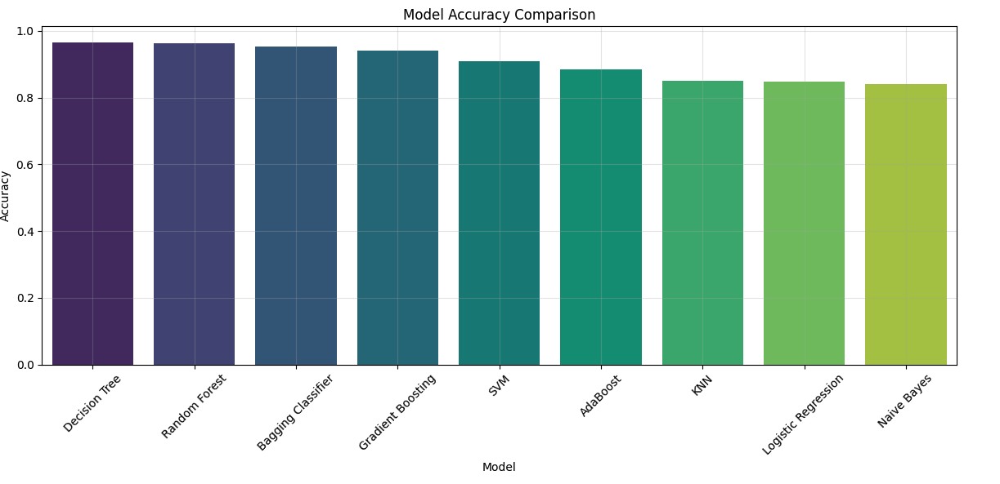
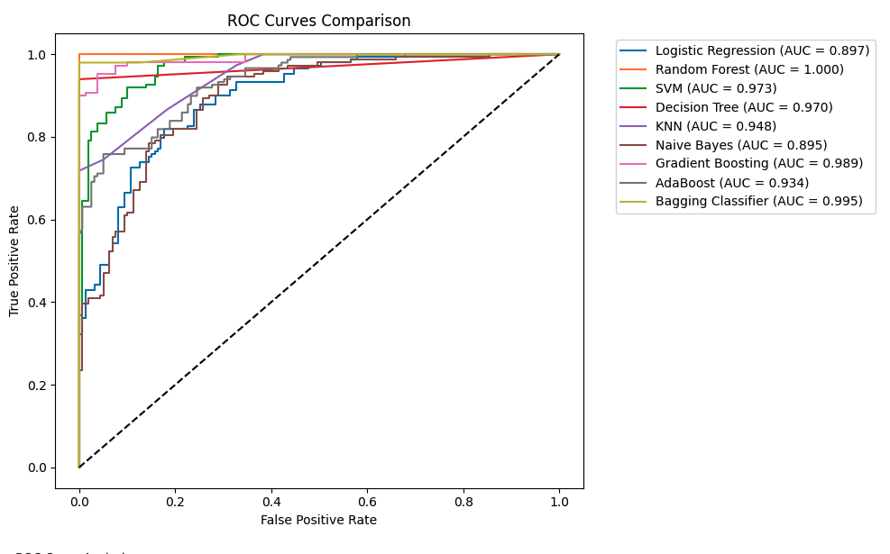
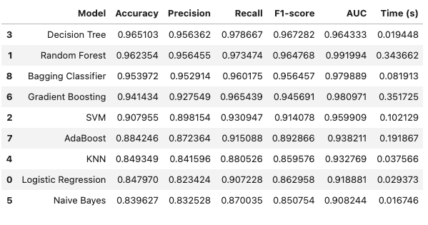

# 🫀 Heart Disease Prediction using Machine Learning

This project applies machine learning to predict the presence of heart disease in patients based on clinical and demographic features. It compares multiple classifiers and concludes with a mock deployment using a Flask API.

## 📌 Project Overview

Heart disease is one of the leading causes of death globally. Early detection using data-driven methods can help save lives. This project focuses on using various machine learning models to predict whether a patient has heart disease based on features such as age, blood pressure, cholesterol, etc.

## 📂 Contents

- **Data Preprocessing**
  - Handling missing values
  - Feature scaling with `StandardScaler`
- **Model Training**
  - Comparison of multiple classification algorithms:
    - Logistic Regression
    - Decision Tree
    - Random Forest
    - Support Vector Machine (SVM)
    - K-Nearest Neighbors (KNN)
    - Naive Bayes
    - Gradient Boosting
    - AdaBoost
    - Bagging Classifier
    - Multi-Layer Perceptron (Neural Network)
- **Evaluation Metrics**
  - Accuracy
  - ROC AUC Score
  - Confusion Matrix
  - Classification Report
- **Hyperparameter Tuning**
  - GridSearchCV for optimal parameter selection
- **Model Deployment**
  - Flask-based mock API for prediction

## 📊 Key Results

- **Random Forest** and **Gradient Boosting** consistently performed among the best across accuracy and AUC metrics.
- The final model was saved as `heart_disease_classification_model.pkl`.
- A **mock API using Flask** was implemented, where users can post patient data in JSON format and receive a prediction in return.

## 📈 Results Summary

### 1. Performance Comparison Across Models


_Table: Comparison of different models on accuracy, precision, recall, F1-score, AUC, and computation time._

### 2. ROC Curves


_Figure: ROC curves for all models. Random Forest and Bagging Classifier achieve the highest AUC._

### 3. Model Accuracy Comparison


_Figure: Bar chart comparing the accuracy of all evaluated models._

### 4. Hyperparameter Tuning

- GridSearchCV used to tune parameters like:
  - `n_estimators`, `max_depth` (RF)
  - `learning_rate`, `max_depth` (GBM)
- Resulted in performance gains compared to default settings

### 5. Deployment Mock

- Final model saved as `heart_disease_classification_model.pkl`
- Flask API accepts POST requests and returns predictions as JSON
- Demonstrates how to transition from notebook to deployable ML service

### 6. Next Steps

- Add feature importance visualization
- Integrate cross-validation and stratification
- Expand Flask app with data validation, exception handling, and logging

## 🚀 How to Run

1. **Clone the repo**:

   ```bash
   git clone https://github.com/your-username/heart_disease_prediction.git
   cd heart_disease_prediction
   ```

2. **Install dependencies**:

   ```bash
   pip install -r requirements.txt
   ```

3. **Launch the notebook**:

   ```bash
   jupyter notebook milestone3.ipynb
   ```

4. **Run the mock deployment API**:
   ```bash
   python app.py
   ```

## 📈 Sample API Input/Output

### POST Request to `/predict`

```json
{
  "age": 52,
  "sex": 1,
  "cp": 0,
  "trestbps": 125,
  "chol": 212,
  "fbs": 0,
  "restecg": 1,
  "thalach": 168,
  "exang": 0,
  "oldpeak": 1.0,
  "slope": 2,
  "ca": 2,
  "thal": 2
}
```

### Response

```json
{
  "prediction": 1
}
```

## ✅ Requirements

- Python 3.8+
- scikit-learn
- pandas
- numpy
- seaborn
- matplotlib
- Flask
- joblib
